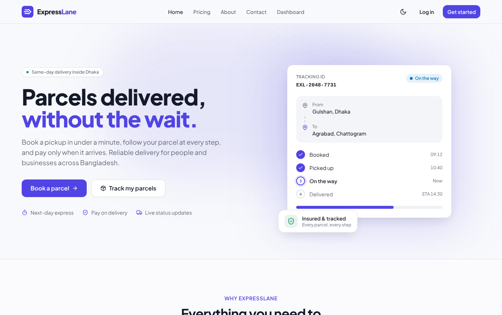
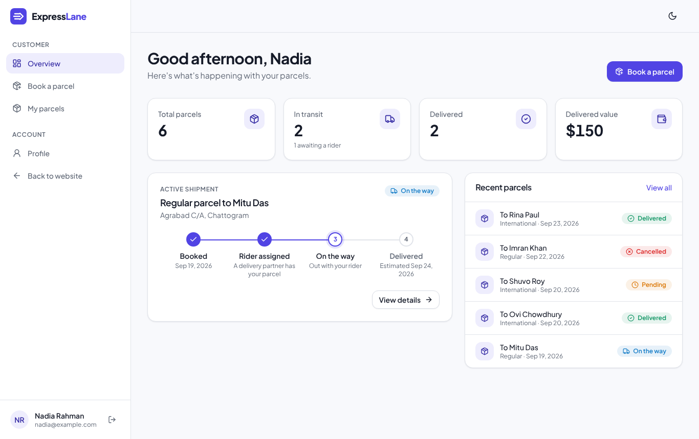
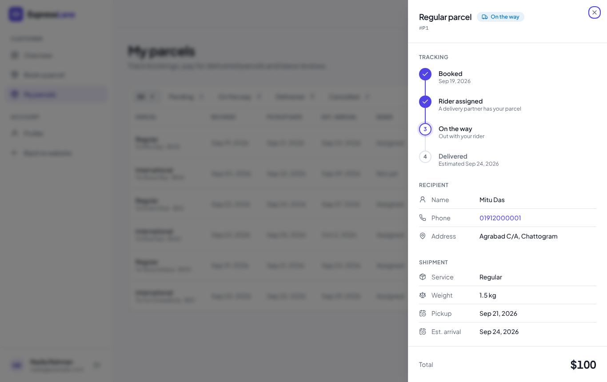
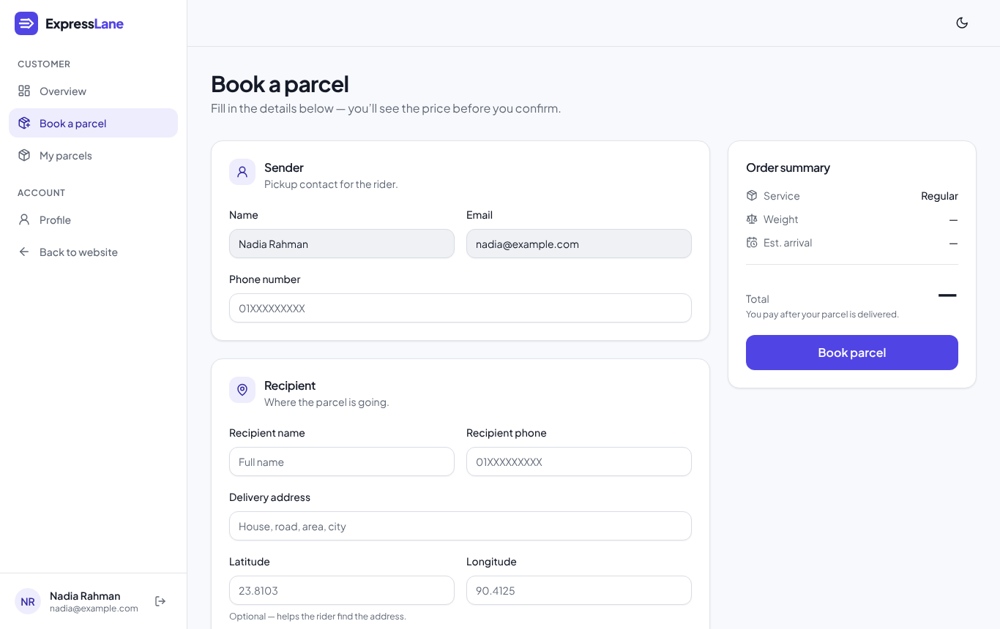
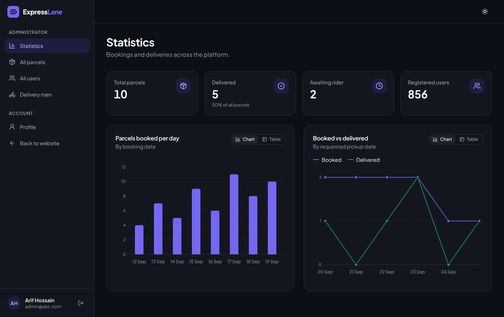
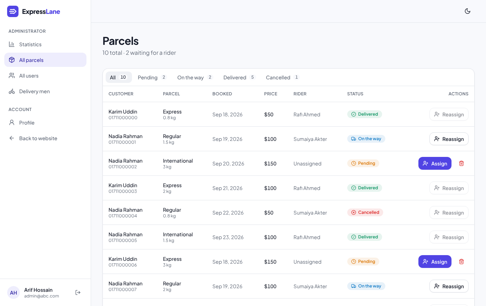
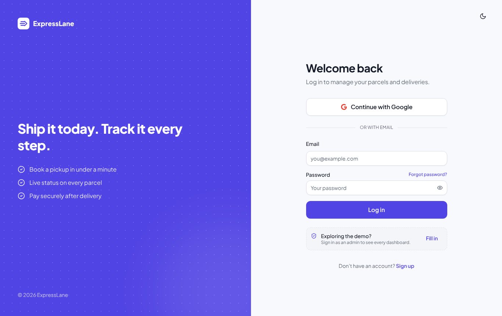
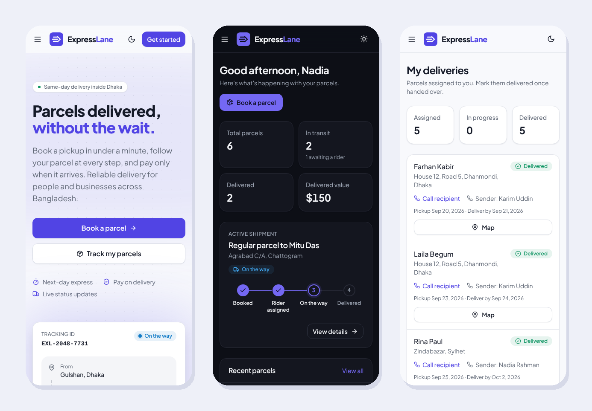
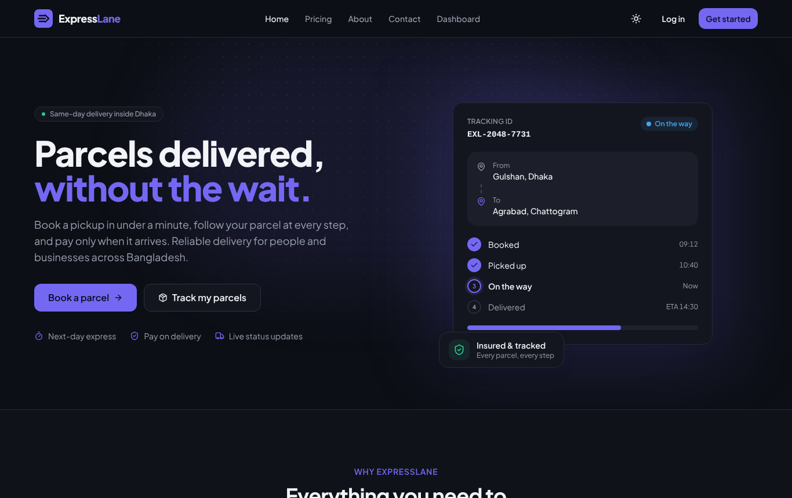

<div align="center">

# ExpressLane

**Parcel delivery, simplified.** Book a pickup in under a minute, follow every step of the journey, and pay once it arrives.

[Live demo](https://expreane-c2384.web.app/) · [Features](#features) · [Screenshots](#screenshots) · [API](#api) · [Getting started](#getting-started)

[](https://github.com/Armstain/Expresslane/actions/workflows/ci.yml)




</div>

## Features

ExpressLane is a full-stack delivery platform with three roles, each with its own dashboard.

### Customers
- **Book in a minute** — sender, recipient and parcel details with a live price and arrival estimate as you type
- **Track every step** — a timeline from *Booked* → *Rider assigned* → *On the way* → *Delivered*
- **Overview dashboard** — active shipment, recent parcels and delivery stats at a glance
- **Pay after delivery** — card payments through Stripe, only once the parcel has arrived
- **Rate the rider** — star ratings and written feedback for every delivered parcel

### Delivery partners
- **Assigned deliveries** with one-tap call links for sender and recipient
- **Map view** of the drop-off location (Leaflet + OpenStreetMap)
- **Mark delivered or cancelled** with confirmation dialogs
- **Reviews page** with average rating and star distribution

### Admins
- **Statistics** — KPI tiles plus bookings-per-day and booked-vs-delivered charts, each with a table view
- **Parcel management** — status filters, rider assignment with an editable delivery date
- **User management** — search, parcel counts and role changes
- **Delivery team** — assigned vs. delivered counts and average ratings per rider

### Across the app
- Light and dark themes that follow the system setting, with no flash on load
- Fully responsive — customer and rider lists become cards on phones, the sidebar becomes a drawer
- Role-aware routing: `/dashboard` sends each role to its own home page
- Route-level code splitting keeps the landing page bundle small
- Accessible by default: keyboard-friendly dialogs, visible focus states, reduced-motion support and chart colours checked for colour-blind separation

## Screenshots

| Customer overview | Parcel tracking |
| --- | --- |
|  |  |
| **Book a parcel** | **Admin statistics (dark)** |
|  |  |
| **Parcel management** | **Sign in** |
|  |  |

<p align="center"></p>

<details>
<summary>Landing page in dark mode</summary>



</details>

## Tech stack

| Layer | Tools |
| --- | --- |
| Front end | React 18, Vite, React Router 6, TanStack Query, Tailwind CSS, shadcn/ui (Radix UI), Lucide icons |
| Charts & maps | ApexCharts, Leaflet / React Leaflet |
| Auth | Firebase Authentication (email + Google); the API verifies Firebase ID tokens with Firebase Admin and issues an HTTP-only session cookie |
| Payments | Stripe Payment Intents + Stripe Elements, verified server-side |
| Back end | Node.js, Express, MongoDB, Helmet, express-rate-limit |
| Testing & CI | Node's built-in test runner + Supertest against a real MongoDB; GitHub Actions runs lint, build and tests |
| Hosting | Firebase Hosting (client), Vercel (API) |

## Project structure

```
client/
  src/
    api/            axios instances and helpers (dates, image upload)
    components/
      ui/           shadcn/ui primitives (button, dialog, sheet, table…)
      Shared/       app-wide building blocks (Logo, PageHeader, StatusBadge…)
      Parcel/       tracking timeline and parcel detail panel
      Dashboard/    sidebar and admin screens
    layouts/        public site and dashboard shells
    pages/          route-level pages (lazy-loaded where possible)
    routes/         router, auth guard and role guard
    lib/            shared parcel rules (pricing, statuses)
server/
  index.js          entry point (local server and Vercel handler)
  src/
    app.js          Express app factory (dependencies injected for testing)
    config.js       environment variables, validated on startup
    db.js           MongoDB connection and indexes
    middleware/     session auth and role guards
    routes/         auth, users, parcels, reviews, stats, payments
    lib/            validation, errors and parcel rules
  test/             API tests
docs/screenshots/   images used in this README
```

## API

Every protected route checks the session cookie, loads the user from the database and checks their role. Roles are never taken from the request or the token.

| Method | Route | Access | Purpose |
| --- | --- | --- | --- |
| POST | `/jwt` | Public (rate-limited) | Exchange a Firebase ID token for a session cookie |
| GET | `/logout` | Public | Clear the session cookie |
| PUT | `/user` | Signed in | Create or update your own profile (new accounts are always customers) |
| GET | `/user/:email` | Self or admin | Profile and role |
| GET | `/users` | Admin | All users, optionally `?role=` |
| PATCH | `/users/update/:id` | Admin | Change a user's role |
| GET | `/top-delivery-men` | Public | Leaderboard with public fields only |
| POST | `/parcel` | Signed in | Book a parcel — price is calculated on the server |
| GET | `/my-parcel/:email` | Self or admin | A customer's parcels |
| DELETE | `/my-parcel/:id` | Owner (pending only) or admin | Cancel or delete a parcel |
| GET | `/parcels` | Admin | All parcels |
| PATCH | `/parcel/:id` | Admin, or the assigned delivery man | Assign a rider, or mark delivered / cancelled |
| GET | `/my-delivery/:email` | Delivery man (self) or admin | Parcels assigned to a rider |
| GET | `/reviews` | Public | Reviews without reviewer emails |
| POST | `/reviews` | Parcel owner | One review per delivered parcel |
| GET | `/reviews/delivery-man/:id` | That delivery man or admin | Reviews for a rider |
| GET | `/statistics` | Public | Headline counts |
| GET | `/bookingsByDate` | Admin | Bookings per day |
| POST | `/create-payment-intent` | Parcel owner | Start a Stripe payment for a delivered parcel |
| POST | `/payments` | Parcel owner | Record a payment after verifying it with Stripe |
| GET | `/payments` | Signed in | Your payment history |

## Getting started

**Prerequisites:** Node.js 18+, a MongoDB database, a Firebase project with Email/Password and Google sign-in enabled, and a Stripe account in test mode.

### 1. API

```bash
cd server
npm install
```

```bash
cp .env.example .env   # then fill in the values
npm run dev            # http://localhost:7000
```

| Variable | Required | Description |
| --- | --- | --- |
| `MONGODB_URI` | Yes | MongoDB connection string |
| `DB_NAME` | No | Database name (default `ExpressLane`) |
| `ACCESS_TOKEN_SECRET` | Yes | Secret for signing session cookies |
| `FIREBASE_PROJECT_ID` | Yes | Your Firebase project id, used to verify sign-ins |
| `STRIPE_SECRET_KEY` | For payments | Stripe secret key |
| `CLIENT_ORIGINS` | No | Comma-separated allowed origins |
| `NODE_ENV` | In production | Set to `production` for secure cross-site cookies |

The server refuses to start if a required variable is missing.

### 2. Client

```bash
cd client
cp .env.example .env.local   # then fill in the values
npm install
npm run dev                  # http://localhost:5173
```

### Tests

The API tests run against a real MongoDB. Point them at any instance with `TEST_MONGODB_URI`, or leave it unset to start a temporary in-memory MongoDB:

```bash
cd server
TEST_MONGODB_URI=mongodb://localhost:27017 npm test
```

The suite covers sign-in, role checks, ownership rules, server-side pricing, reviews and payment verification.

### Roles

New accounts start as customers. Promote a user to **DeliveryMen** or **admin** from the admin *Users* page, or by editing the `role` field in the `users` collection.

## Roadmap

- Stripe webhooks as a second confirmation path for payments
- Real-time status updates with WebSockets
- Move from MongoDB to PostgreSQL for relational parcel/rider/review data
